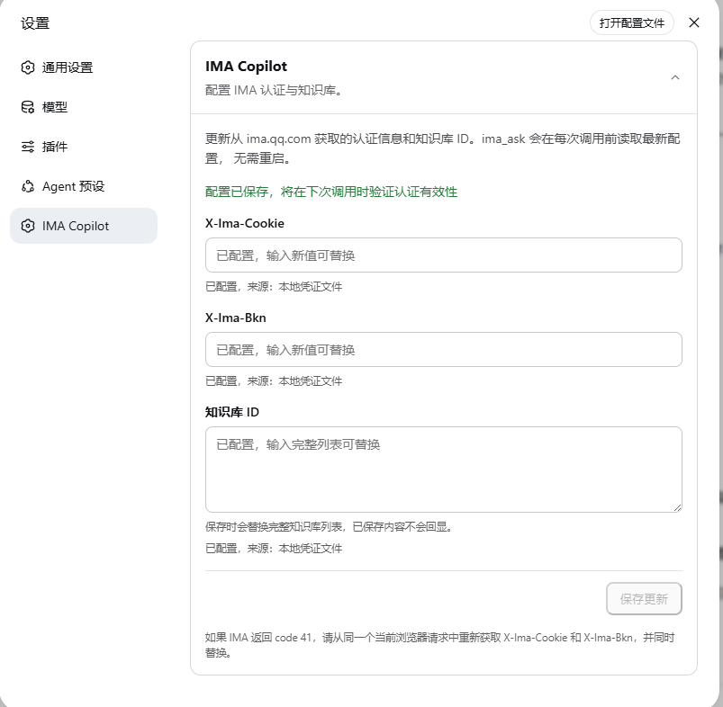

# dsh-ima-copilot

腾讯 IMA 是一个非常好的知识库应用，但是他们提供的skill版本针对公开知识库的检索方式只提供了基于文件标题的关键字检索，好一阵无语。为了补足在harness的这种知识库检索能力，基于tencent-ima-copilot-mcp迭代了对应的dsh版本。腾讯 IMA Copilot 的 DSH 原生工具插件。它把 IMA 知识库问答直接注册为 `ima_ask`，让 Agent 能按问题语义检索、归纳并返回引用资料，补足官方公开知识库skill能力主要依赖标题关键字搜索的限制。

本项目基于 [highkay/tencent-ima-copilot-mcp](https://github.com/highkay/tencent-ima-copilot-mcp) 的 IMA 接口实现改造为 DSH bundle：无需启动 MCP、FastMCP、Python 服务或常驻子进程，并提供 Web 配置界面。



## 功能

- 注册原生工具 `ima_ask`，支持单知识库自动选择与多知识库显式选择。
- 返回回答正文及资料 ID、标题、知识库名称等引用信息。
- 在“设置 → 插件 → IMA Copilot”中维护认证信息和知识库 ID。
- 每次调用前读取最新配置；修改配置后无需重启 DSH。
- 内置超时、并发限制、瞬时失败重试与取消处理。
- 凭证明文仅通过 DSH Credentials API 读写，不回显到 Web 页面。

## 环境要求

- Node.js `^22.19.0` 或 `>=24.0.0`
- DSH `0.1.1-rc.2`
- Web profile 需要 `@deepseek-ai/dsh-client-ui-settings-plugins`

本版本对应 DeepSeek Harness Release
[`dsh-v0.1.1-rc.2`](https://github.com/deepseek-ai/deepseek-harness/releases/tag/dsh-v0.1.1-rc.2) 和提交
[`b150a551b8d465e31e418e1b2eaf5e79bbb7d28e`](https://github.com/deepseek-ai/deepseek-harness/commit/b150a551b8d465e31e418e1b2eaf5e79bbb7d28e)。`package.json` 中的 `deepseekHarness` 记录了这一源码基线；本地链接脚本会同时校验提交和版本，避免误用其他破坏性迭代节点。

当前插件版本为 `0.1.1-rc.2.ima.1`，npm `latest` 和 `rc` 通道对应这一经过验证的 Harness rc.2 基线。`alpha` 通道继续保留 `0.1.2-alpha.2.ima.1`，仅用于跟随 Harness alpha 测试线。

> 本插件调用的是 IMA Web API，而非公开稳定 API；上游接口变化可能导致插件需要同步适配。

## 安装

安装当前默认版本（Harness `0.1.1-rc.2` 基线）：

```powershell
dsh plugin --profile web add dsh-ima-copilot
dsh web
```

如需显式安装 Harness alpha 测试线对应的历史版本：

```powershell
dsh plugin --profile web add dsh-ima-copilot@alpha
```

使用 GitHub 地址进行安装：

```powershell
dsh plugin --profile web add https://github.com/onclaw-dev/dsh-ima-copilot.git
dsh web
```


从源码或本地打包文件安装：

```powershell
npm ci
npm run link:harness -- <本地 DSH 仓库路径>
npm run verify
npm pack
dsh plugin --profile web add .\dsh-ima-copilot-0.1.1-rc.2.ima.1.tgz
dsh web
```

安装后重启 Web profile，使新增工具和设置卡生效。可用以下命令确认 bundle 已挂载：

```powershell
dsh --profile web --dump-config
```

输出中应包含 `ima-copilot`。

## 配置

打开“设置 → 插件 → IMA Copilot”，填写以下三项：

| 字段 | DSH 凭证引用 | 说明 |
| --- | --- | --- |
| X-Ima-Cookie | `IMA_X_IMA_COOKIE` | IMA 请求的完整 Cookie |
| X-Ima-Bkn | `IMA_X_IMA_BKN` | IMA 请求头中的业务密钥 |
| 知识库 ID | `IMA_KNOWLEDGE_BASE_IDS` | 每行一个 ID，或使用逗号分隔 |

### 获取认证信息

1. 登录 [IMA Copilot](https://ima.qq.com)。
2. 打开浏览器开发者工具的 Network（网络）面板。
3. 在 IMA 中发送一条消息，找到 `/cgi-bin/assistant/qa` 请求。
4. 从同一个请求的原始 Request Headers 中复制完整的 `x-ima-cookie` 和 `x-ima-bkn`，并在设置页同时更新；不要复制包含 `…` 的截断摘要值。
5. 在目标知识库页面找到 `init_session` 请求，从请求体读取 `knowledge_base_id`。

设置页只读取 `configured`、`source` 和 `writable` 状态，不读取或回显已保存的值。保存新的知识库 ID 时，请输入完整列表；新列表会替换旧列表。

## 工具说明

### `ima_ask`

| 参数 | 必填 | 说明 |
| --- | --- | --- |
| `question` | 是 | 要向 IMA 知识库提出的非空问题 |
| `knowledgeBaseId` | 否 | 目标知识库 ID；配置多个知识库时必填，且必须位于配置列表中 |

返回示例：

```json
{
  "answer": "回答正文",
  "references": [
    {
      "id": "资料 ID",
      "title": "资料标题",
      "knowledgeBase": "知识库名称"
    }
  ]
}
```

未完成配置、知识库列表为空或选择了列表外的 ID 时，工具会在访问 IMA 前失败并给出配置提示。

## 运行机制

一次 `ima_ask` 调用会：

1. 从 DSH credential provider 读取最新 Cookie、Bkn 和知识库 ID 列表。
2. 校验配置并确定目标知识库。
3. 刷新 IMA token，创建一次性 IMA session 并请求答案。
4. 解析 SSE 回答与引用，随后释放并发许可。

插件不会保留 IMA 会话或认证前置状态，因此不支持跨调用的 IMA 对话历史。默认运行参数定义在 [cordis.patch.yml](./cordis.patch.yml)：请求超时 300 秒、瞬时失败重试 3 次、并发上限 1。

## 开发与验证

```powershell
npm ci
npm run link:harness -- <本地 DSH 仓库路径>
npm run check
npm test
npm run build
npm run verify:package
```

当前 `0.1.1-rc.2` 的 DSH 开发包可由上述精确提交的本地 DSH 源码提供。链接脚本不会把 monorepo 根目录冒充某个 workspace 包；它会校验提交后，分别链接插件实际使用的包。链接完成后也可以用一条命令执行类型检查、测试和构建：

```powershell
npm run verify
```

在 Web profile 已配置有效凭证后，可执行真实连通性测试。该命令不会输出凭证明文或答案正文：

```powershell
npm run verify:live
```

## 已知限制

- IMA Web API 不是公开稳定 API，上游字段、鉴权或 SSE 格式变化时可能需要更新插件。
- token 刷新结果只在当前调用内使用；认证失效后需重新获取 Cookie 与 Bkn。
- 设置页采用 write-only 凭证引用，不能展示已保存的知识库 ID 明文。
- Workflow Designer 可发现并配置原生 `ima_ask`；是否支持 Live Invoke 取决于 Designer 版本。

## 来源与许可证

IMA 请求及响应解析逻辑源自 [tencent-ima-copilot-mcp](https://github.com/highkay/tencent-ima-copilot-mcp)，本仓库将其适配为 DSH 原生 bundle/plugin。项目继承并采用 [MIT License](./LICENSE)。

DSH 是 DeepSeek Harness 的生态简称。本项目是社区插件，与腾讯 IMA 或 DeepSeek 官方均无隶属或背书关系。
